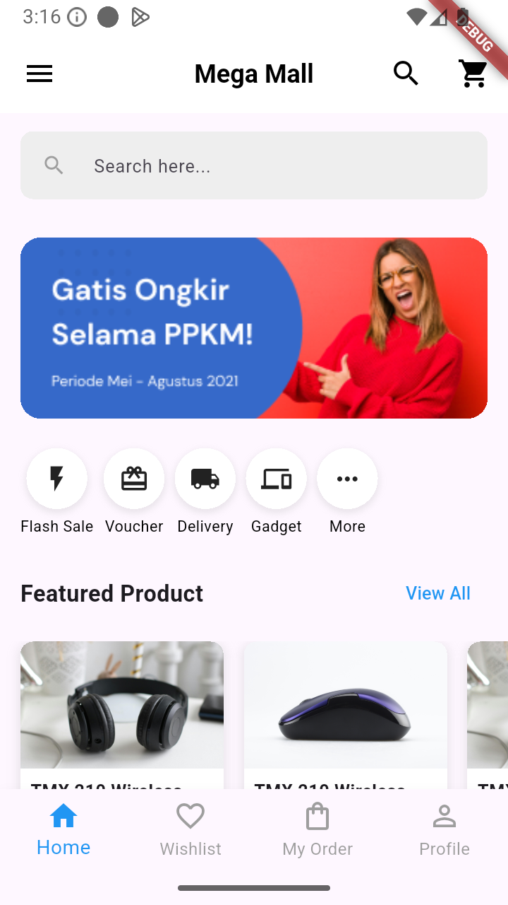
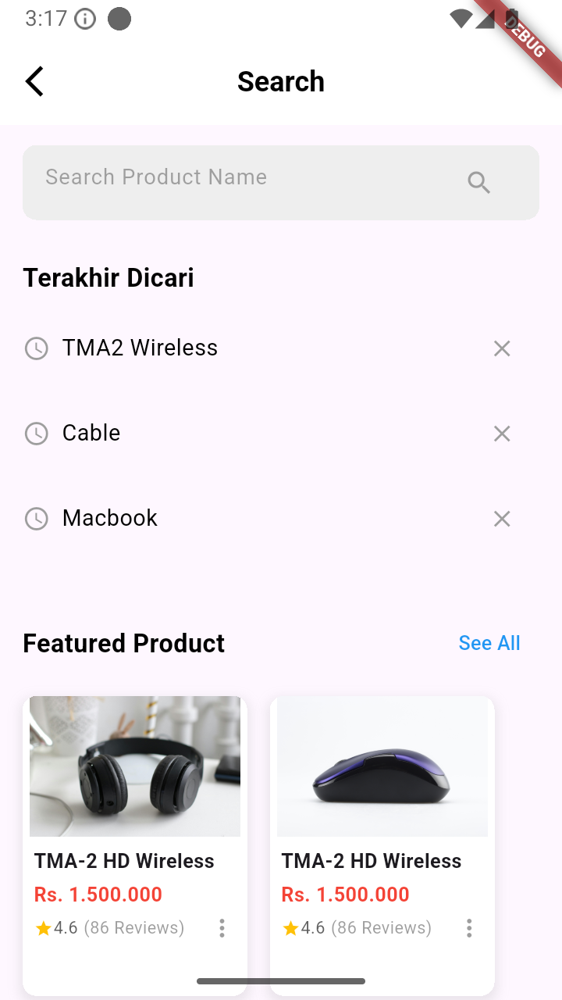
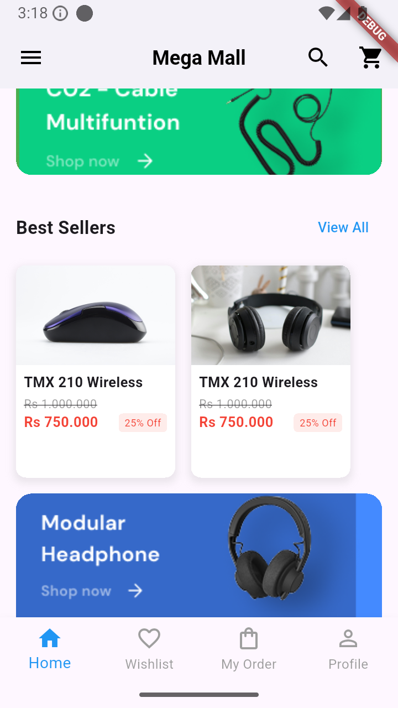
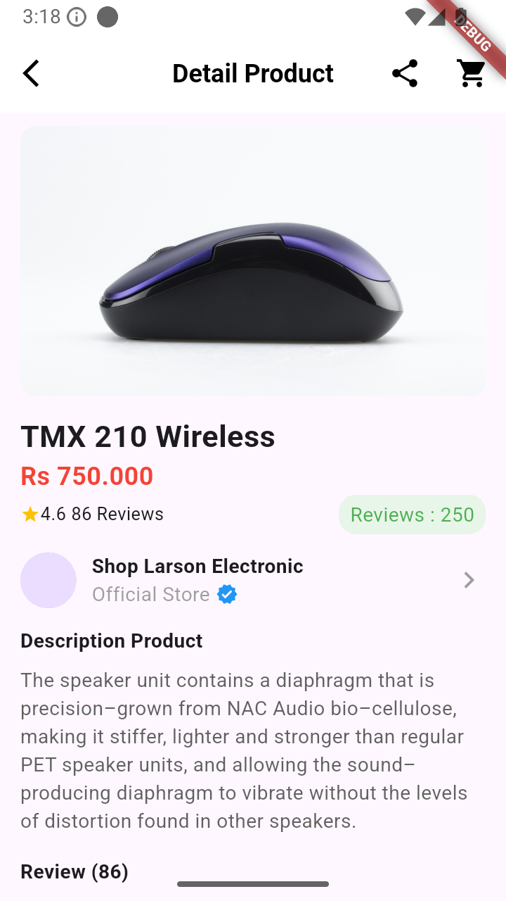
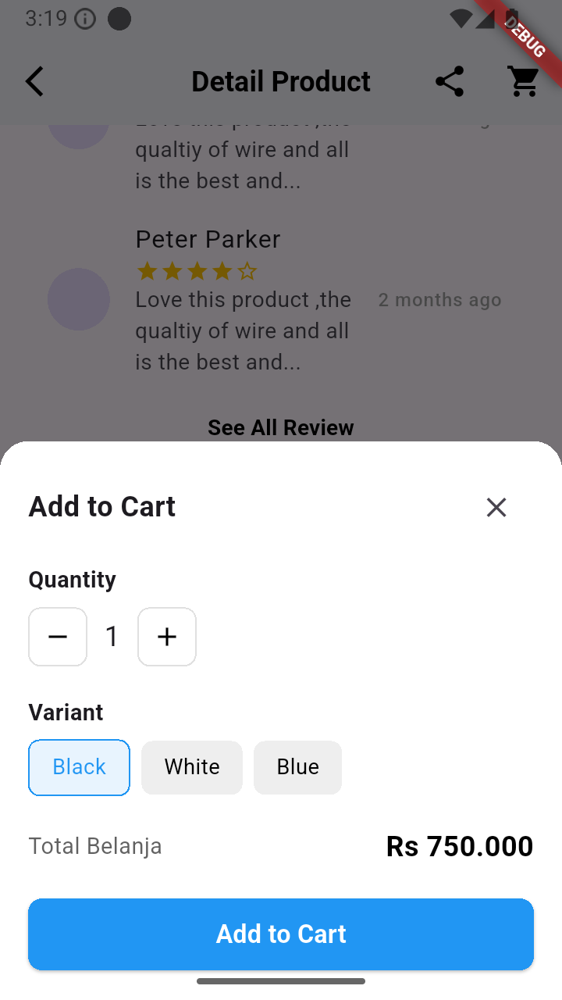
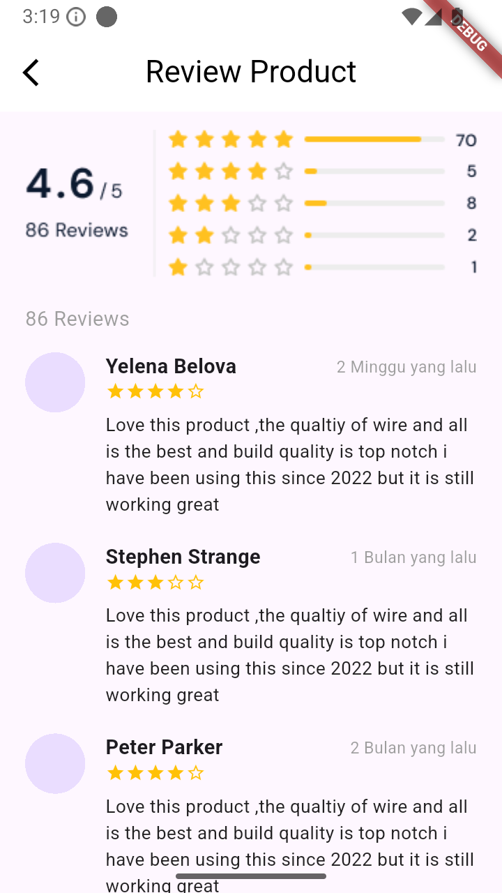
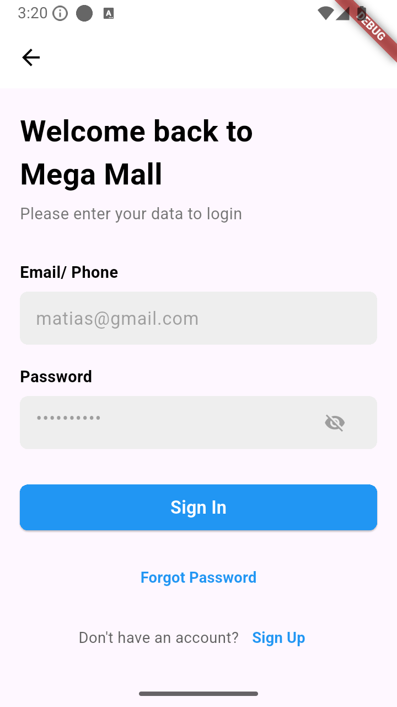

# 🛒 Flutter eCommerce App

A full-featured eCommerce mobile application built using **Flutter**. This app provides a seamless shopping experience with modern UI, product listings, cart management, and secure checkout functionality.

---

## 🚀 Features

- ✨ Beautiful UI with modern design
- 🛍️ Browse products by categories
- 🔍 Product detail pages
- 🛒 Add to Cart and Cart Summary
- 💳 Secure Checkout flow
- 🔐 Firebase Authentication (Login / Register)
- 🌐 Firebase Remote Config integration
- 🌍 In-app WebView support
- 📶 Internet connection checker
- 🧭 Bottom navigation bar
- 📱 Responsive for all screen sizes

---

## 📱 Screenshots

<!-- Replace with your own screenshots -->
        

---

## 🛠️ Tech Stack

- **Flutter** (Dart)
- **Firebase** (Auth, Remote Config)
- **Provider** 
- **GoRouter** for navigation
- **WebView** for external shop integration
- **Internet Connection Checker Plus**

---

## 📂 Folder Structure

